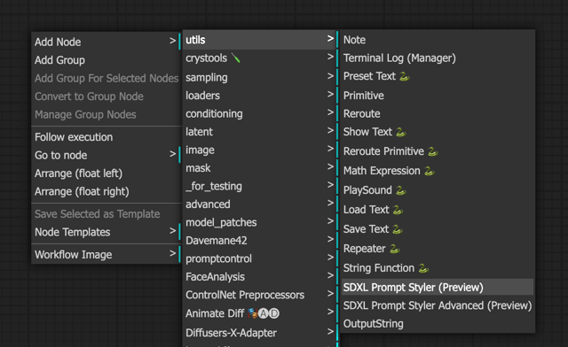
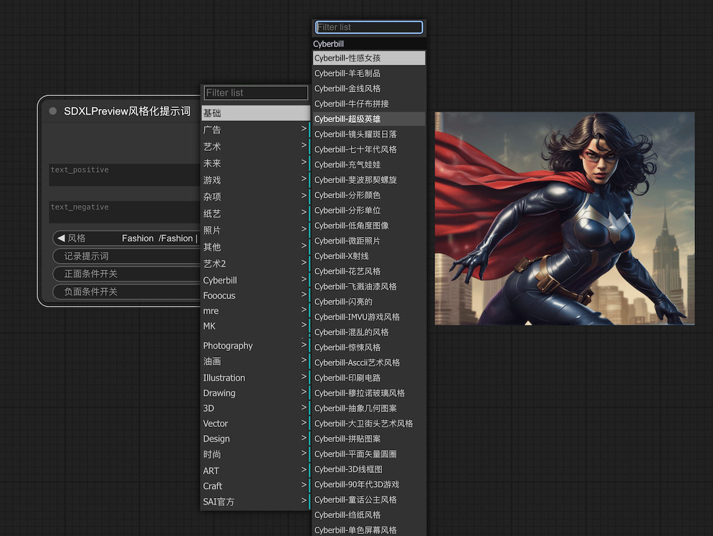
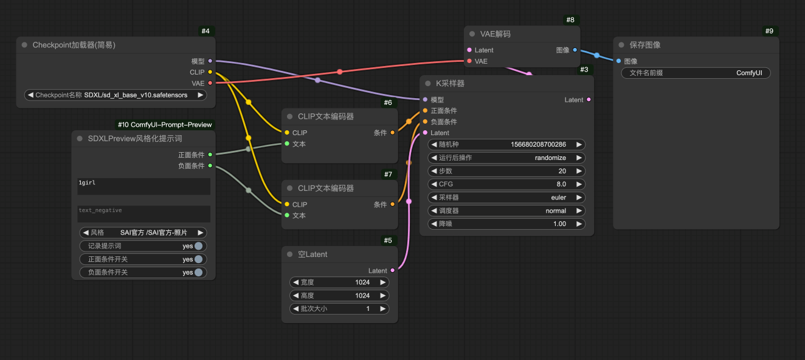

# ComfyUI-SDXL-Style-Preview
欢迎来到ComfyUI SDXL Style Preview, 本插件是sdxl_prompt_styler的升级版，原版插件请访问 [sdxl_prompt_styler](https://github.com/twri/sdxl_prompt_styler).
## 更新说明
- 2024.11.27
- 修复了部分错误（预览图错位、代码提示与新增）- [@quanzaiyu](https://github.com/quanzaiyu)  [@amimi818](https://github.com/amimi818) 贡献代码；
- 新增了风格种类250+ -@quanzaiyu贡献代码；
- 翻译问题修复by -B站用户“云涧惊鸿”贡献代码；
## 界面截图
- 插件位置截图：
- 
- 插件界面截图：
- 
- 插件使用方法(工作流)截图：
- 
## 功能介绍
- 本插件只适用于SDXL及以上版本，不适用SD1.5模型。可以实现只连接SDXL大模型（包括但不限于XL基础版、XL-Lightning版、第三方微调版等）就可以画出不同风格的图，无需LoRA。
- 本插件内的预览图都是由本人使用SDXL模型生成，无版权纠纷。 [界面的汉化请点击这里下载](https://pan.quark.cn/s/a0e2d7393be1)
- 为了方便在线查找关键词、查看翻译，同时方便WebUI用户使用，这里整理了个在线版表格，[可以点击此处查看](https://docs.qq.com/sheet/DYkpTY1V5WGhTaklK?nlc=1&tab=dcfxzc)
## 本插件的优势
- 1、分组功能。按照类别进行分组，方便查找；
- 2、预览图功能。每种风格都配有一张预览图，快速定位喜欢的风格；
- 3、包含艺术风格种类570+（原版107种）；

## 参考
- [sdxl_prompt_styler](https://github.com/twri/sdxl_prompt_styler)
- [ComfyUI-Custom-Scripts](https://github.com/pythongosssss/ComfyUI-Custom-Scripts)

- 打赏自愿，下载自由
